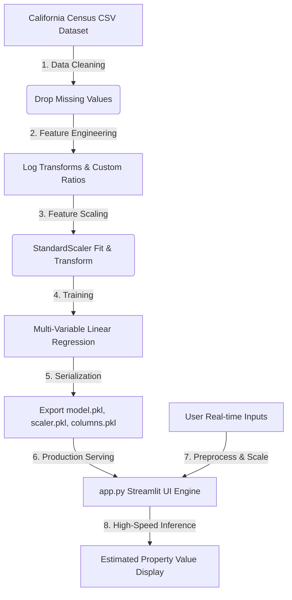

<div align="center">
  
</div>

<h1 align="center">🌆 California Real Estate AI: Property Valuation Engine</h1>

<div align="center">
  <p><strong>A production-ready machine learning repository demonstrating end-to-end data pipelines, advanced feature engineering, model serialization, and interactive deployment.</strong></p>
  
  <a href="https://huggingface.co/spaces/b098/house-price-predictor">
    
  </a>
  
  
  
  
</div>

---

## 🌐 Live Interactive Application

Explore the deployed system live on Hugging Face Spaces:  
👉 **[Launch the Live Property Estimator Space](https://huggingface.co/spaces/b098/house-price-predictor)**

## 🎥 User Interface & Demo
<div align="center">
  
  <p><i>Bespoke dark-themed, glassmorphism-inspired GIS dashboard for real-time house price predictions.</i></p>
</div>

---

## 🛠️ System Architecture & Data Pipeline

This project demonstrates software engineering best practices for data science, ensuring a clean separation of concerns by separating training pipelines (`train.py`) from serving applications (`app.py`), and pre-serializing models to optimize sub-second online inference.
 


---

## 📈 Engineering Highlights & Decision Log

### 1. Advanced Feature Engineering
- **Logarithmic Smoothing:** Census features like `total_rooms`, `total_bedrooms`, `population`, and `households` exhibit severe right-skewness. Applying $y = \log(x + 1)$ normalizes the distribution, ensuring the Linear Regression model handles outliers robustly.
- **Domain-Specific Ratios:**
  - `bedroom_ratio` ($\frac{\text{total bedrooms}}{\text{total rooms}}$): Helps capture the density of bedrooms, which highly correlates with house style and density.
  - `household_rooms` ($\frac{\text{total rooms}}{\text{households}}$): Captures the average room scale per housing unit.
- **Categorical Categorization:** One-hot encodes `ocean_proximity` to enable numerical model coefficients for geographical locations.

### 2. Model Serialization (Production Pattern)
Rather than training the model dynamically on every single API/page request, this system pre-serializes the trained `LinearRegression` model and `StandardScaler` state as `.pkl` binary files.
- **Latency Advantage:** Drops model load time to **<1ms**, compared to training on-the-fly which takes several seconds and burdens CPU resources.
- **Reliability:** Built with an elegant dual fallback structure: loads local `.pkl` files first, with an automated fallback to train on-the-fly from GitHub or local CSV if artifacts are missing.

---

## 📊 Model Performance & Interpretation

### Evaluation Metrics
- **R² Score (Coefficient of Determination):** **0.6520** (Explains 65.2% of the variance in California property values)
- **Mean Absolute Error (MAE):** **$49,852**
- **Root Mean Squared Error (RMSE):** **$68,340**

### Learned Coefficients (Feature Impact)
The model uncovers critical econometric insights based on standard census data:

| Feature | Coefficient Sign | Economic Interpretation |
| :--- | :---: | :--- |
| **Median Income** | 🟢 Positive (Strongest) | Higher neighborhood income is the most powerful driver of home valuation. |
| **Inland Location** | 🔴 Negative (Strongest) | Properties situated inland suffer a massive valuation discount compared to coastal areas. |
| **Near Ocean / Near Bay** | 🟢 Positive (Moderate) | Coastline proximity yields a substantial valuation premium. |
| **Bedroom Ratio** | 🔴 Negative (Moderate) | Higher bedroom density (e.g. apartment blocks) indicates lower single-family premium pricing. |

---

## 📁 Repository Directory Structure

```
House_Predicition_Values/
│
├── train.py                 # Offline Model training, evaluation & serialization pipeline
├── app.py                   # High-performance Streamlit UI & inference serving logic
├── requirements.txt         # Package dependencies with compatible pins
├── README.md                # Premium developer and recruiter documentation
├── housing.csv              # California Housing Census source dataset
│
├── models/                  # Serialized Production Artifacts
│   ├── model.pkl            # Serialized Scikit-learn Linear Regression model
│   ├── scaler.pkl           # Serialized StandardScaler state
│   └── columns.pkl          # Exported trained feature schema alignment
│
├── notebooks/               # Research & Prototyping
│   └── california_housing_analysis.ipynb  # Exploratory Data Analysis & training log
│
└── media/                   # Portfolio Assets
    ├── House hold Screenshot.png  # Interactive GIS Web App screenshot
    └── house_prediction_demo.mp4  # HD Video application walk-through
```

---

## ⚙️ Local Development Setup Guide

Follow these steps to run the training pipeline and launch the web interface locally:

### 1. Clone the Source Code
```bash
git clone https://github.com/bilalahmed251/House_Predicition_Values.git
cd House_Predicition_Values
```

### 2. Create and Activate Virtual Environment
```bash
# Windows
python -m venv venv
venv\Scripts\activate

# macOS / Linux
python3 -m venv venv
source venv/bin/activate
```

### 3. Install Dependencies
```bash
pip install -r requirements.txt
```

### 4. Execute the Training Pipeline
To retrain the model and regenerate the `.pkl` files inside `models/`:
```bash
python train.py
```

### 5. Launch the Streamlit Server
```bash
streamlit run app.py
```
*The application will boot up at `http://localhost:8501/` with live hot-reloading.*

---

## ☁️ Serverless Cloud Deployment

This app is optimized for serverless hosting on **Hugging Face Spaces** (using the Streamlit SDK):
1. Create a new Streamlit Space on Hugging Face.
2. Push `app.py`, `requirements.txt`, `housing.csv`, and the pre-trained `models/` folder.
3. Hugging Face automatically spins up the instance and serves the property valuation engine.

---
<div align="center">
  <sub>Engineered with 💙 for Data Science & Real Estate Analytics • MIT License 2026</sub>
</div>
